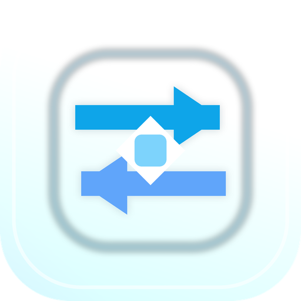

# Codex Switch

<p align="center">
  
</p>

<p align="center">
  <a href="README.en.md">English</a> | 简体中文
</p>

<p align="center">
  <a href="https://github.com/qiyadeng/CodexSwitch/releases/latest">
    
  </a>
  <a href="https://github.com/qiyadeng/CodexSwitch/releases">
    
  </a>
  
</p>

Codex Switch 是一款本地优先的桌面管理工具，用来统一管理 Codex、Antigravity、Cursor、Windsurf、Kiro、GitHub Copilot、Gemini CLI、CodeBuddy、Qoder、Trae、Zed 等 AI 编程工具的账号、实例、额度和切换流程。

它适合需要在多个账号、多个工作区或多套 AI 编程工具之间频繁切换的用户：把账号状态、额度监控、启动路径、实例入口和自动刷新放在同一个应用里，减少来回找配置文件和重复登录的时间。

## 主要功能

- 多平台账号管理：统一查看和切换 Codex、Antigravity、Cursor、Windsurf、Kiro、GitHub Copilot 等工具账号。
- Codex 体验增强：支持 Codex 账号列表、分组、实例管理、额度刷新、额度提醒和切换后启动应用。
- 实例与工作区：集中管理不同工具的实例入口，快速回到对应项目或工作环境。
- 本地优先：核心配置保存在本机，敏感信息不会为了展示功能上传到第三方服务。
- 自动更新：桌面端使用 GitHub Releases 分发更新文件，支持应用内检查更新。
- 多语言界面：内置中文、英文、日文、韩文、德文、法文、西班牙文等多语言资源。

## 下载

前往 [GitHub Releases](https://github.com/qiyadeng/CodexSwitch/releases/latest) 下载最新版本。

| 平台 | 推荐安装包 |
| --- | --- |
| Windows | `.exe` / `.msi` |
| macOS | `.dmg` |
| Linux | `.AppImage` / `.deb` / `.rpm` |

macOS 首次打开如果遇到安全提示，可在“系统设置 > 隐私与安全性”中允许打开，或按项目发布说明中的命令移除隔离属性。

## 截图


## 本地开发

```bash
npm install
npm run dev
```

常用检查命令：

```bash
npm run typecheck
npm run build
```

生成桌面图标：

```bash
python scripts/generate_app_icons.py
```

## 发布与更新

Codex Switch 使用 Tauri 2 构建桌面应用，并通过 GitHub Releases 分发安装包和 `latest.json` 更新文件。发布新版本时需要确保：

- `package.json`、`src-tauri/tauri.conf.json`、`src-tauri/Cargo.toml` 中的版本号一致。
- Release 附件包含对应平台安装包。
- `latest.json` 指向当前版本并带有有效签名。

## 隐私说明

Codex Switch 的设计重点是本地管理和本地切换。应用不会把账号列表、路径配置或使用习惯上传到项目维护者的服务器。第三方工具自身的登录、同步和网络行为仍由对应工具及其服务商决定。

## 致谢

本项目基于原 Cockpit Tools 继续演进，感谢原作者和社区贡献者。

## License

本项目使用 `CC-BY-NC-SA-4.0` 许可协议。未获得单独书面授权前，请勿将本项目用于商业用途。
